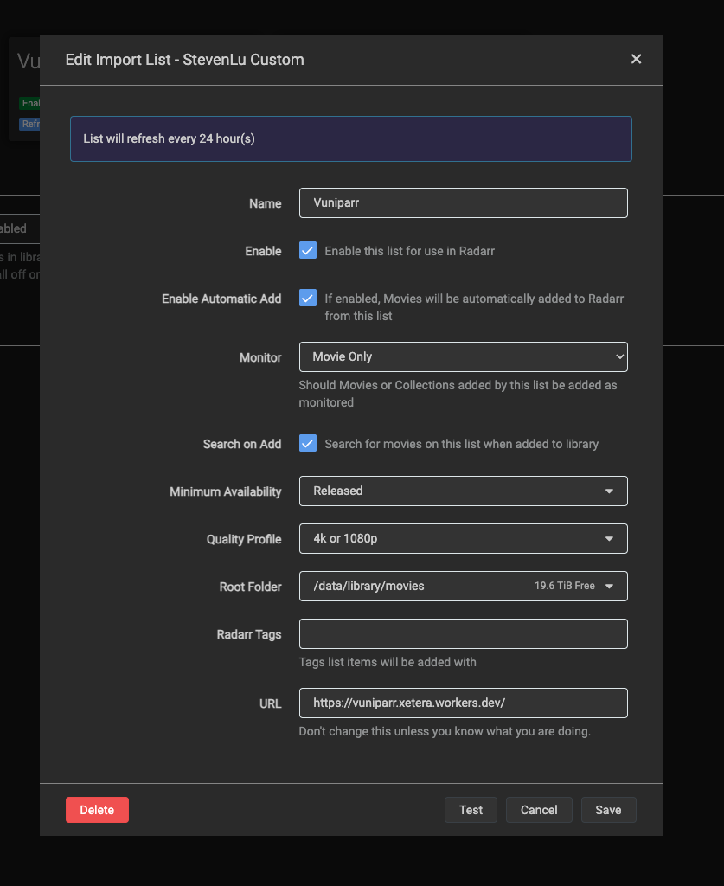

# Vuniparr

A radarr compatible import list for movies that drop on [vuniper](https://vuniper.com/movies). The response is globally cached for 20 minutes to avoid hammering the API.

You can use this as an automated way to grab stuff from https://www.reddit.com/r/movieleaks

## Usage

Go to Radarr under Lists -> `+` -> StevenLu Custom -> Paste the following

https://vuniparr.xetera.workers.dev

